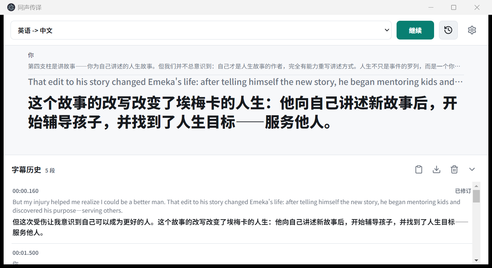

# 声桥 LinguaBridge

桌面端 AI 同声传译助手。打开声桥后，可以把浏览器视频、桌面会议、通话软件、麦克风或本地音视频文件里的声音转成中英双语字幕，并通过悬浮歌词窗覆盖在其他应用上方。主字幕采用类似歌词的当前句模式，最近字幕会随着 ASR final、翻译修正、大模型润色和重连恢复自动更新，帮助你跟上外语内容节奏。


## 界面预览



主界面使用固定双语字幕槽位：原文与译文拥有稳定的阅读锚点，流式识别、翻译草稿和润色结果持续更新时，换行不会推动整组字幕上下移动。完整长句仍会保留到字幕历史中。

## 适合谁用

声桥面向经常观看英语技术分享、国际会议、外语网课，或需要参加跨语言桌面会议的用户。第一版重点覆盖 Windows 桌面使用：启动应用、选择系统音频或麦克风、配置 AI 服务后，即可把电脑正在播放的人声实时转成中文字幕；也可以反向把中文转成英文字幕。

## 核心功能

| 功能 | 说明 |
| --- | --- |
| 系统音频同传 | 捕获电脑正在播放的声音，适合浏览器视频、会议软件、播放器和通话软件 |
| 麦克风收音 | 系统音频受限时，可用麦克风收外放声音或直接收人声 |
| 文件模拟实时输入 | 上传本地音频/视频文件，按实时节奏验证 ASR、翻译、字幕和播报链路 |
| 歌词式字幕 | 主界面只突出当前正在讲的一句，上一句弱化显示或进入历史 |
| 稳定双语布局 | 原文和译文使用独立固定槽位，限制可见行数并消除流式换行造成的上下抖动 |
| 低延迟翻译 | 稳定 partial 可先生成草稿译文，final 到达后原地修订 |
| 双语润色 | 稳定字幕会进入大模型润色慢通道，减少翻译腔，中文和英文都会更自然 |
| 中英双向字幕 | 支持英语转中文、中文转英文，语言接口已按后续扩展预留 |
| 字幕自动修订 | 当前句和 recent 字幕会根据 ASR partial/final、翻译修正和 provider 恢复状态原地更新 |
| 悬浮歌词窗 | 可拖动、可锁定、支持鼠标穿透，覆盖在浏览器、会议或通话窗口上方 |
| 可选译文播报 | 稳定译文可进入本地语音播报队列，支持暂停和停止 |
| 服务状态可见 | 诊断抽屉显示 provider、API Key、连接状态、队列深度、延迟和可恢复错误 |

## 快速启动

克隆项目：

```bash
git clone https://github.com/Hddcc/Simultaneous-Interpretation.git
cd Simultaneous-Interpretation
```

安装依赖：

```bash
npm install
```

启动开发版桌面应用：

```bash
npm run dev
```

构建项目：

```bash
npm run build
```

构建后启动：

```bash
npm start
```

如果 Electron 在当前终端被当作普通 Node 进程启动，先清除 `ELECTRON_RUN_AS_NODE`，再重新运行启动命令。

## 配置真实 API

默认配置使用本地 mock provider，适合先熟悉界面和流程。真实体验需要在本地创建 `.env`，密钥只保存在自己的电脑上：

```bat
copy .env.example .env
```

如果你使用 PowerShell，也可以执行：

```powershell
Copy-Item .env.example .env
```

### 推荐方案：阿里百炼单 Key

如果你已经在阿里云百炼 / Model Studio 创建了 API Key，推荐先用这一套。一个 `DASHSCOPE_API_KEY` 同时用于 `fun-asr-realtime` 实时语音识别和 Qwen 翻译；模型在请求时通过 `REALTIME_ASR_MODEL` 和 `TRANSLATION_MODEL` 指定。

```dotenv
VITE_AI_PROVIDER=aliyun
VITE_ASR_MODE=provider

REALTIME_ASR_PROVIDER=aliyun
REALTIME_ASR_MODEL=fun-asr-realtime
REALTIME_ASR_BASE_URL=wss://dashscope.aliyuncs.com/api-ws/v1/inference

TRANSLATION_PROVIDER=aliyun
TRANSLATION_MODEL=qwen-plus
TRANSLATION_BASE_URL=https://dashscope.aliyuncs.com/compatible-mode/v1

DASHSCOPE_API_KEY=your_dashscope_api_key
```

这条路径适合想用最少配置真实体验同传的用户。请确认百炼账号已开通对应模型、地域和额度。

### 可选方案：只用 OpenAI

OpenAI 可以承担实时 ASR、文件转写和翻译。

```dotenv
VITE_AI_PROVIDER=openai
VITE_ASR_MODE=provider

REALTIME_ASR_PROVIDER=openai
REALTIME_ASR_MODEL=gpt-4o-mini-transcribe
REALTIME_ASR_BASE_URL=https://api.openai.com/v1

TRANSLATION_PROVIDER=openai
TRANSLATION_MODEL=gpt-4.1-mini
TRANSLATION_BASE_URL=https://api.openai.com/v1

OPENAI_API_KEY=your_openai_api_key
```

### 可选方案：OpenAI ASR + DeepSeek 翻译

DeepSeek 适合承担文本翻译；音频识别仍需要 OpenAI 或其他 ASR provider。配置方式如下：

```dotenv
VITE_AI_PROVIDER=openai
VITE_ASR_MODE=provider

REALTIME_ASR_PROVIDER=openai
REALTIME_ASR_MODEL=gpt-4o-mini-transcribe
REALTIME_ASR_BASE_URL=https://api.openai.com/v1
OPENAI_API_KEY=your_openai_api_key

TRANSLATION_PROVIDER=deepseek
TRANSLATION_MODEL=deepseek-chat
TRANSLATION_BASE_URL=https://api.deepseek.com
DEEPSEEK_API_KEY=your_deepseek_api_key
```

### 本地模拟模式

保留下面的默认值即可进入本地模拟模式。它会展示完整 UI、字幕修订、悬浮窗和播报体验，适合无密钥时试用。

```dotenv
VITE_AI_PROVIDER=mock
VITE_ASR_MODE=mock
REALTIME_ASR_PROVIDER=mock
TRANSLATION_PROVIDER=mock
```

## 使用方式

主窗口只保留语言方向、开始/暂停、历史和设置。音频源、设备或文件、字号、主题、悬浮字幕与译文播报集中在右上角设置中。字幕历史默认收起，会跨会话保存在本机；展开后可复制、导出 TXT 或确认清空。

### 浏览器视频、网课或播放器

1. 打开浏览器、网课页面或播放器，让视频开始播放。
2. 打开设置，将音频源切换为“系统音频”。
3. 刷新并选择浏览器窗口、播放器窗口或整个屏幕。
4. 点击“开始”，观察当前原文和突出显示的译文；需要回看时展开字幕历史。
5. 打开“悬浮字幕”，把歌词窗拖到视频上方；需要操作下方网页时可锁定悬浮窗。

浏览器视频是最推荐优先测试的真实桌面场景。系统音频成功时，不需要上传文件，字幕会直接来自电脑正在播放的声音。

### 腾讯会议、微信通话或类似软件

1. 先确认会议或通话软件正在输出清晰人声。
2. 在设置中选择“系统音频”，启动同传。
3. 打开悬浮字幕并切回会议或通话窗口。锁定后可让鼠标操作穿过字幕窗。
4. 如果系统音频被会议/通话软件限制，切换到“麦克风”，用外放声音继续收音。

会议和通话软件对系统声音共享、窗口捕获和输出设备的处理差异较大。声桥会显示捕获状态和可恢复错误，便于你判断当前环境是否需要 fallback。

### 麦克风收音

1. 在设置中选择“麦克风”。
2. 允许系统或 Electron 访问麦克风。
3. 选择可用设备后点击“开始”。
4. 直接说话，或让电脑外放会议/视频声音给麦克风收音。

麦克风模式适合快速验证、会议软件限制系统音频时的备用输入，以及临时面对面对话。

### 文件模拟实时输入

1. 在设置中选择“文件模拟”。
2. 选择本地音频或视频文件。
3. 点击“开始”，声桥会按实时节奏生成字幕。

文件模拟适合调试 API、演示固定素材，以及对比歌词式字幕和字幕修订效果。它不会替代桌面系统音频场景，但能稳定复现完整同传链路。

### 译文语音播报

打开“译文播报”后，稳定译文会进入本地 Web Speech 播报队列。系统没有可用语音、浏览器环境不支持 `speechSynthesis` 或应用被静音时，字幕仍会正常显示。

## 支持场景与限制

| 场景 | 当前状态 | 说明 |
| --- | --- | --- |
| 浏览器视频/网课 | 可手工验证 | 推荐使用系统音频，成功时无需上传文件 |
| 腾讯会议或类似会议软件 | 可手工验证 | 受会议软件、输出设备和系统权限影响；受限时使用麦克风 fallback |
| 微信或类似通话软件 | 可手工验证 | 通话软件可能限制音频捕获；受限时使用麦克风 fallback |
| 麦克风输入 | 可用 | 适合 fallback、面对面收音和快速测试 |
| 本地音视频文件 | 可用 | 适合模拟实时播放和稳定复现 |
| 悬浮字幕 | 可用 | 可拖动、锁定和重置；部分窗口管理器可能影响置顶或鼠标穿透 |
| 译文播报 | 可选 | 依赖系统 Web Speech 能力 |

系统音频的完整覆盖优先面向 Windows。应用会检测 `native-audio-helper/wasapi-loopback-helper.exe` 或等价 WASAPI loopback helper 的可用性；helper 缺失时会继续尝试 Electron `desktopCapturer` fallback。不同应用是否提供可捕获音轨，取决于 Windows 权限、音频输出设备、会议/通话软件策略和 Electron 当前能力。

| 平台 | 系统音频 | 麦克风 | 文件 | 精简界面与本地历史 |
| --- | --- | --- | --- | --- |
| Windows | 完整验收，WASAPI 能力检测 + Electron fallback | 支持 | 支持 | 支持 |
| macOS | Electron `desktopCapturer` fallback，受系统权限限制 | 支持 | 支持 | 支持 |
| Linux | Electron `desktopCapturer` fallback，受桌面环境限制 | 支持 | 支持 | 支持 |

## 常见问题

### 启动后提示缺少 API Key

检查 `.env` 是否位于项目根目录，并确认当前 provider 对应的 Key 已经填写。阿里百炼单 Key 模式需要 `DASHSCOPE_API_KEY`；OpenAI 模式需要 `OPENAI_API_KEY`；DeepSeek 翻译模式需要 `DEEPSEEK_API_KEY`。修改 `.env` 后需要重启应用。

### 启动时提示 5173 端口被占用

开发模式固定使用 Vite 的 `5173` 端口。先关闭之前启动的 `npm run dev` 窗口；如果进程仍在后台运行，可以在 PowerShell 中定位并结束该端口对应的进程：

```powershell
$processId = (Get-NetTCPConnection -State Listen -LocalPort 5173).OwningProcess
Stop-Process -Id $processId
npm run dev
```

执行 `Stop-Process` 前应确认该进程属于本项目的 Vite 开发服务。

### 可以只用阿里百炼吗？

可以。配置 `REALTIME_ASR_PROVIDER=aliyun` 和 `TRANSLATION_PROVIDER=aliyun` 后，声桥会用 `fun-asr-realtime` 识别音频，再用 Qwen 模型翻译文本。你只需要在本地 `.env` 里填写 `DASHSCOPE_API_KEY`。

### 可以只用 DeepSeek 吗？

DeepSeek 可以用于文本翻译。实时同传还需要 ASR 把音频转成文字，所以完整路径需要搭配阿里百炼 `fun-asr-realtime`、OpenAI ASR 或其他 ASR provider。

### 系统音频没有声音或没有字幕

先确认目标应用正在播放声音，再刷新系统音频来源。浏览器视频可优先选择浏览器窗口或整个屏幕。会议和通话软件受限时，切换到麦克风收外放声音；也可以用文件模拟确认 provider 和字幕链路是否正常。

### 字幕会改来改去吗？

当前句会随着 ASR final 和翻译修正原地更新，这是为了降低实时识别误差。上一句会弱化显示或进入历史，较早字幕会逐步稳定，避免历史记录持续跳动。

### 真实延迟大概由什么决定？

主要由音频块时长、网络连接、ASR 响应、fast-draft 模型、队列压力和字幕修订策略共同决定。内部验收把延迟分开计算：首稿延迟从合格 ASR partial 进入翻译调度算到第一个可读译文提交；端到端延迟从该 partial 对应的音频证据结束算到首稿提交。final 翻译和后台润色各自记录，不会继续抬高已经形成的首稿样本。

### 语速快时会怎样追上当前内容？

主字幕使用 latest-wins：active lane 保留一个进行中请求和一个最新等待请求，新的 partial 可以替换旧等待项并尝试取消旧请求。final 内容进入独立的历史补全 lane，晚到译文会更新已有历史，主字幕继续显示当前句。积压期间后台润色自动暂停，压力解除后恢复。

这套优化沿用现有字幕区、历史、悬浮窗和操作入口，没有新增标签、按钮、面板或设置项。provider 和公网波动仍会影响结果，参考目标为首稿平均 `<=500ms`、P95 `<=900ms`，端到端 P50 `<=800ms`、P95 `<=1500ms`。

### 如何配置 fast-draft？

`FAST_DRAFT_MODEL` 可指定同一 provider 下的低延迟模型，留空时安全回退到 `TRANSLATION_MODEL`。兼容 provider 可通过 `FAST_DRAFT_STREAMING=true` 提前提交可读流式草稿；完整响应继续作为 fallback。2026-07-25 的同样本实测中，`qwen-turbo` 的首个可读草稿 mean 为 `293.5ms`、P95 为 `362ms`，优于 `qwen-plus` 的 `608.1ms` 和 `783ms`，因此阿里云 fast-draft 推荐使用 `qwen-turbo`，final/refinement 继续使用 `qwen-plus`。完整方法和质量审计见 [fast-draft 模型基准](docs/verification/fast-draft-model-benchmark-2026-07-25.md)。

## 技术栈与分层

```text
桌面音频来源
  -> 统一音频块 / Payload 队列
  -> 实时 ASR provider session
  -> 翻译 provider
  -> 低延迟翻译调度
  -> 双语润色慢通道
  -> 歌词式字幕 cue / 修订与历史
  -> 主客户端 / 悬浮字幕 / 可选 TTS
```

主要技术：

| 模块 | 技术 |
| --- | --- |
| 桌面壳 | Electron |
| 前端界面 | React + TypeScript |
| 构建工具 | Vite |
| 实时 ASR | Aliyun DashScope `fun-asr-realtime` / OpenAI Realtime transcription / mock |
| 翻译 | Aliyun Qwen / OpenAI / DeepSeek-compatible text provider / mock |
| 系统音频 | Windows WASAPI loopback helper 检测 + Electron desktopCapturer fallback |
| 语音播报 | Web Speech `speechSynthesis` |

主要目录：

```text
electron/        主进程、preload、安全边界、provider session、桌面来源和 helper 能力检测
src/audio/       音频来源、统一 chunk、payload metadata、队列状态和文件模拟
src/asr/         ASR 配置、事件模型和客户端入口
src/translation/ 翻译请求、provider 响应和字幕片段模型
src/captions/    歌词式 active cue、previous cue、历史和延迟状态
src/realtime/     实时分片、partial 阈值和延迟调参
src/subtitles/   字幕修订与归并逻辑
src/tts/         译文播报状态
docs/verification/ 真实桌面场景验证说明
```

## 依赖与原创实现

第三方依赖主要用于桌面运行、前端渲染、构建和本地开发流程，包括 `electron`、`react`、`react-dom`、`vite`、`typescript`、`concurrently` 和 `wait-on`。AI 服务通过用户本地配置的 Aliyun DashScope API、OpenAI API、DeepSeek-compatible API 或 mock provider 接入。

本项目原创实现包括：桌面同传客户端、系统音频/麦克风/文件三类输入入口、统一音频块与 provider-ready payload 合约、实时 provider session 状态、低延迟翻译调度、双语润色慢通道、歌词式字幕 cue、字幕修订归并、悬浮字幕窗口、可选译文播报，以及真实桌面场景验证清单。

更完整的依赖与原创功能说明见 `docs/review/dependencies-and-originality.md`。

## 验证项目

常用验证命令：

```bash
npm run build
openspec validate --all
```

真实桌面体验建议按 `docs/verification/desktop-scenarios.md` 检查：浏览器视频、会议软件、通话软件、歌词式低延迟字幕、麦克风 fallback、悬浮字幕和可选译文播报。延迟阈值和调参说明见 `docs/verification/lyric-low-latency-tuning.md`。

运行自动化检查：

```powershell
npm test
npm run build
openspec validate realtime-catch-up-scheduler --strict
```

真实 provider 参考报告使用预热后的固定英语样本，输入至少 50 个合格首稿样本：

```powershell
npm run verify:latency-reference -- .\path\to\reference-samples.json
```

## 后续计划

- 增加更多语言方向和 provider 配置。
- 补充更完整的 Windows WASAPI loopback helper 分发与安装体验。
- 提升会议和通话软件在不同设备组合下的捕获诊断能力。
- 增加云端 TTS 或更自然的本地播报选项。
